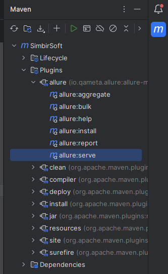
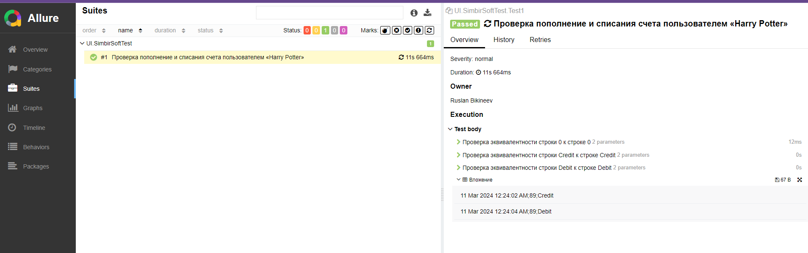

Для запуска теста необходимо запустить Selenium Grid командой:  
 - java -jar selenium-server-\<version>.jar standalone --port 4444    

Allure отчет запускает через Maven: 
 - Plagins->allure:server->build  

 -   

 -   